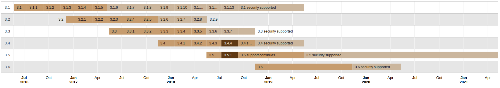

Release Notes
#############

From Moodle 2.6 onwards, the end of support, both general and security, happens the second Monday of May and November, observing the 12, 18... month periods, no matter if the major release was delayed or not.

The most recent long-term support release (LTS) version is Moodle 3.5.

.. toctree::
  :maxdepth: 3
  :caption: Versions:

  3.5/index
